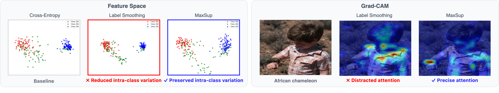
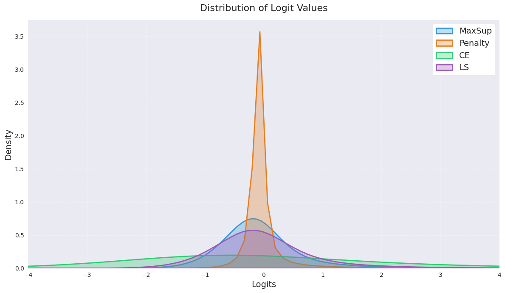
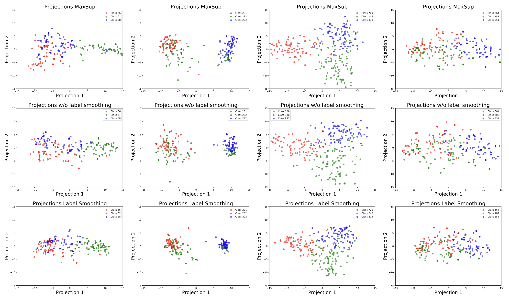

# MaxSup: Overcoming Representation Collapse in Label Smoothing

**Max Suppression (MaxSup)** is a novel regularization technique that overcomes the shortcomings of traditional **Label Smoothing (LS)**. While LS prevents overconfidence by softening one-hot labels, it inadvertently collapses intra-class feature diversity and can boost overconfident errors. In contrast, **MaxSup** applies a uniform smoothing penalty to the model’s top prediction—regardless of correctness—preserving richer per-sample information and improving both classification performance and downstream transfer.

---

## Table of Contents

- [MaxSup: Overcoming Representation Collapse in Label Smoothing](#maxsup-overcoming-representation-collapse-in-label-smoothing)
  - [Table of Contents](#table-of-contents)
  - [Overview](#overview)
  - [Methodology: MaxSup vs. Label Smoothing](#methodology-maxsup-vs-label-smoothing)
  - [Enhanced Feature Representation](#enhanced-feature-representation)
    - [Qualitative Evaluation](#qualitative-evaluation)
    - [Quantitative Evaluation](#quantitative-evaluation)
  - [Training Vision Transformers with MaxSup](#training-vision-transformers-with-maxsup)
    - [To Train a ViT with MaxSup:](#to-train-a-vit-with-maxsup)
    - [Accelerated Data Loading via Caching (Optional)](#accelerated-data-loading-via-caching-optional)
    - [Preparing Data and Annotations for Caching](#preparing-data-and-annotations-for-caching)
  - [Fine-grained Image Classification](#fine-grained-image-classification)
  - [Pretrained Weights](#pretrained-weights)
  - [Training ConvNets with MaxSup](#training-convnets-with-maxsup)
  - [Logit Characteristic Visualization](#logit-characteristic-visualization)
    - [Step 1: Extract Logits](#step-1-extract-logits)
    - [Step 2: Analyze Logits](#step-2-analyze-logits)
  - [More about Improved Feature Space](#more-about-improved-feature-space)
  - [References](#references)

---

## Overview

Traditional Label Smoothing (LS) replaces one-hot labels with a smoothed version to reduce overconfidence. However, LS can over-tighten feature clusters within each class and may reinforce errors by making mispredictions overconfident. **MaxSup** tackles these issues by applying a smoothing penalty to the model's **top-1 logit** output regardless of whether the prediction is correct, thus preserving intra-class diversity and enhancing inter-class separation. The result is improved performance on both classification tasks and downstream applications such as linear transfer and image segmentation.

---

## Methodology: MaxSup vs. Label Smoothing

Label Smoothing softens the target distribution by blending the one-hot vector with a uniform distribution. Although effective at reducing overconfidence, LS inadvertently introduces two effects:
- A **regularization term** that limits the sharpness of predictions.
- An **error-enhancement term** that can cause overconfident wrong predictions.

**MaxSup** addresses this by uniformly penalizing the highest logit output, whether it corresponds to the true class or not. This approach enforces a consistent regularization effect across all samples. In formula form:

```math
L_{\text{MaxSup}} = \alpha \left( z_{\max} - \frac{1}{K}\sum_{k=1}^{K} z_k \right),
```

where \( z_{\max} \) is the highest logit among the \( K \) classes. This mechanism prevents the prediction distribution from becoming too peaky while preserving informative signals from non-target classes.

---

## Enhanced Feature Representation

### Qualitative Evaluation

MaxSup-trained models display richer intra-class feature diversity compared to models trained with traditional LS. Feature embedding visualizations show that while LS forces features into tight clusters, MaxSup preserves finer-grained differences among samples. Grad-CAM analyses also demonstrate that MaxSup-trained models focus more precisely on relevant class-discriminative regions.

  
**Figure 1:** Feature representations. MaxSup maintains greater intra-class diversity and clear inter-class boundaries.

  
**Figure 2:** Grad-CAM visualizations. The MaxSup model (row 2) accurately highlights target objects, whereas the LS model (row 3) and Baseline (row 4) show more diffuse activations.

### Quantitative Evaluation

We evaluated feature representations on ResNet-50 trained on ImageNet-1K. Intra-class variation (reflecting the diversity within classes) and inter-class separability (indicating class distinctiveness) were measured. Additionally, a linear transfer learning task on CIFAR-10 was performed.

**Table 1: Feature Representation Metrics (ResNet-50 on ImageNet-1K)**

| Method                    | Intra-class Var. (Train) | Intra-class Var. (Val) | Inter-class Sep. (Train) | Inter-class Sep. (Val) |
|---------------------------|--------------------------|------------------------|--------------------------|------------------------|
| **Baseline**              | 0.3114                   | 0.3313                 | 0.4025                   | 0.4451                 |
| **Label Smoothing**       | 0.2632                   | 0.2543                 | 0.4690                   | 0.4611                 |
| **Online LS**             | 0.2707                   | 0.2820                 | 0.5943                   | 0.5708                 |
| **Zipf’s LS**             | 0.2611                   | 0.2932                 | 0.5522                   | 0.4790                 |
| **MaxSup (ours)**         | **0.2926**               | **0.2998**             | 0.5188                   | 0.4972                 |

*Higher intra-class variation indicates more preserved sample-specific details, while higher inter-class separability suggests better class discrimination.*

**Table 2: Linear Transfer Accuracy on CIFAR-10**

| Pretraining Method   | Accuracy (%) |
|----------------------|--------------|
| **Baseline**         | 81.43        |
| **Label Smoothing**  | 74.58        |
| **MaxSup**           | **81.02**    |

Label Smoothing degrades transfer accuracy due to its over-smoothing effect, whereas MaxSup nearly matches the baseline performance while still offering improved calibration.

We have also conducted comprehensive experiments on both [imbalanced dataset](LT/) (on CIFAR10-LT with varying imbalance ratios (50, and 100)) and [out-of-distribution](OOD/) (on CIFAR10-C) datasets.

**Table 3**: Comparison of overall accuracy (%) (jointly considering many-shot, median-shot, and low-shot top-1 accuracy) for different loss strategies (Focal Loss vs Label Smoothing (LS) vs MaxSup) across datasets, imbalance levels, and backbones. Best performances are in bold.


| **Dataset**           | **Split** | **Imbalance Ratio** | **Backbone** | **Method**      | **Overall** | **Many** | **Medium** | **Low** |
|-----------------------|-----------|----------------------|--------------|------------------|------------|--------|----------|--------|
| Long-tailed CIFAR-10  | val       | 50                   | Resnet32     | Focal Loss       | 77.4       |  76.0      |  89.7        |   0.0     |
|                       |           |                      |              | LS              | 81.2       |  81.6      |   77.0       |   0.0     |
|                       |           |                      |              | MaxSup          | **82.1**   |  82.5      |     78.1     |   0.0     |
| Long-tailed CIFAR-10  | test      | 50                   | Resnet32     | Focal Loss       | 76.8       |  75.3      |  90.4        |   0.0     |
|                       |           |                      |              | LS              | 80.5       |  81.1      |   75.4       |   0.0     |
|                       |           |                      |              | MaxSup          | **81.4**   |  82.3      |  73.4        |   0.0     |
| Long-tailed CIFAR-10  | val       | 100                  | Resnet32     | Focal Loss       | 75.1       |  71.8      |  88.3        |   0.0     |
|                       |           |                      |              | LS              | 76.6       |   80.6     |   60.7       |  0.0      |
|                       |           |                      |              | MaxSup          | **77.1**   |   80.1     |  65.1        |   0.0     |
| Long-tailed CIFAR-10  | test      | 100                  | Resnet32     | Focal Loss       | 74.7       |  71.6      |     87.2     |     0.0   |
|                       |           |                      |              | LS              | 76.4       |   80.8     |    59.0      |   0.0     |
|                       |           |                      |              | MaxSup          | **76.4**   |  79.9      |    62.4      |    0.0    |

**Table 4**: Comparison of MaxSup and Label Smoothing (LS) on CIFAR10-C using Resnet50 as backbone. For all metrics, lower value is better, and best performances are in bold.

| Metric         | MaxSup | LS |
|----------------|--------|------------------|
| Error (Corr)   | **0.3951** | **0.3951**           |
| NLL (Corr)     | 1.8431 | **1.5730**           |
| ECE (Corr)     | **0.1479** | 0.1741           |

---

## Training Vision Transformers with MaxSup

We integrated MaxSup into the training pipeline for Vision Transformers using the [DeiT](https://github.com/facebookresearch/deit) framework.

### To Train a ViT with MaxSup:

```bash
cd Deit
python train_with_MaxSup.sh
```

This script trains a DeiT-Small model on ImageNet-1K with MaxSup regularization.

### Accelerated Data Loading via Caching (Optional)

For improved data loading efficiency on systems with slow I/O, a caching mechanism is provided. This feature compresses the ImageNet dataset into ZIP files and loads them into memory. Enable caching by adding the `--cache` flag to the training script.

### Preparing Data and Annotations for Caching

1. **Create ZIP Archives:**  
   In your ImageNet data directory, run:
   ```bash
   cd data/ImageNet
   zip -r train.zip train
   zip -r val.zip val
   ```

2. **Mapping Files:**  
   Download `train_map.txt` and `val_map.txt` from our release assets and place them in the `data/ImageNet` directory. The directory should appear as follows:
   ```
   data/ImageNet/
   ├── train_map.txt      # Relative paths and labels for training images
   ├── val_map.txt        # Relative paths and labels for validation images
   ├── train.zip          # Compressed training images
   └── val.zip            # Compressed validation images
   ```
   - **train_map.txt:** Each line should be in the format `<class_folder>/<image_filename>\t<label>`.
   - **val_map.txt:** Each line should be in the format `<image_filename>\t<label>`.

## Fine-grained Image Classification 

Beyond large-scale benchmarks such as ImageNet, we further evaluate MaxSup on two fine-grained visual recognition datasets: CUB-200-2011 and Stanford Cars.
These datasets present subtle inter-class differences that often expose the limitations of standard regularization techniques.

As shown below, MaxSup achieves the best performance on both datasets, surpassing Label Smoothing (LS) and its recent variants.
This indicates that MaxSup helps models learn more discriminative and semantically rich feature representations, effectively capturing fine-grained attributes such as textures and part-level details.
The consistent gains across domains further demonstrate MaxSup’s strong generalization ability and robustness in recognition tasks requiring nuanced feature understanding.

| Method     | CUB (Acc %) | Cars (Acc %) |
| ---------- | ----------- | ------------ |
| Baseline   | 80.88       | 90.27        |
| LS         | 81.96       | 91.64        |
| OLS        | 82.33       | 91.96        |
| Zipf-LS    | 81.40       | 90.99        |
| **MaxSup** | **82.53**   | **92.25**    |


---

## Pretrained Weights

Pretrained checkpoints for both Vision Transformers and ConvNets are available:

- **Vision Transformer (DeiT-Small):** Available in the release titled **"checkpoint_deit"**. This includes the model `.pth` file and training logs.
- **ConvNet (ResNet-50):** Pretrained weights can be downloaded from [https://huggingface.co/zhouyuxuanyx/MaxSup-Regularized-ResNet50/tree/main](https://huggingface.co/zhouyuxuanyx/MaxSup-Regularized-ResNet50/tree/main). Baseline and LS variants are also provided for comparison.

These checkpoints can be used for direct evaluation or fine-tuning on downstream tasks.

---

## Training ConvNets with MaxSup

The `Conv/` directory provides scripts for training convolutional networks with MaxSup:

- **Conv/ffcv:** Contains scripts to reproduce ImageNet results using FFCV for efficient data loading. See `Conv/ffcv/README.md` for details.
- **Conv/common_resnet:** Contains additional experiments with ResNet architectures. Refer to `Conv/common_resnet/README.md` for further instructions.

---

## Logit Characteristic Visualization

The `viz/` directory contains a toolkit to analyze the distribution of logits produced by models trained with LS versus MaxSup.

### Step 1: Extract Logits

Run the following command to extract logits from your trained model:

```bash
python viz/logits.py \
    --checkpoint /path/to/model_checkpoint.pth \
    --output /path/to/save/logits_labels.pt
```

- `--checkpoint`: Path to your model checkpoint.
- `--output`: Destination file for the extracted logits and labels.

### Step 2: Analyze Logits

After extraction, run:

```bash
python viz/analysis.py --input /path/to/save/logits_labels.pt --output /path/to/analysis_results/
```

This script generates:
- A histogram of near-zero logit proportions.
- A scatter plot comparing top-1 probabilities with near-zero proportions.
- Saved visualizations for side-by-side comparisons.

  
**Figure 3:** Logit distribution comparing LS and MaxSup. 

## More about Improved Feature Space 



**Figure.4:** Visualization of penultimate-layer activations from DeiT-Small (trained with CutMix and Mixup) on the ImageNet validation set.

## References
- **DeiT (Vision Transformer):**  
  Touvron et al., *Training Data-Efficient Image Transformers & Distillation through Attention*, ICML 2021. [GitHub](https://github.com/facebookresearch/deit).
- **Grad-CAM:**  
  Selvaraju et al., *Grad-CAM: Visual Explanations from Deep Networks via Gradient-based Localization*, ICCV 2017.
- **Online Label Smoothing:** See paper for details.
- **Zipf’s Label Smoothing:** See paper for details.

## Citation

```bibtex
@article{zhou2025maxsup,
  title={Maxsup: Overcoming representation collapse in label smoothing},
  author={Zhou, Yuxuan and Li, Heng and Cheng, Zhi-Qi and Yan, Xudong and Dong, Yifei and Fritz, Mario and Keuper, Margret},
  journal={arXiv preprint arXiv:2502.15798},
  year={2025}
}

---

This repository provides the official implementation of MaxSup. Contributions and discussions are welcome. For any questions or issues, please open an issue on GitHub or contact the authors directly.

---
